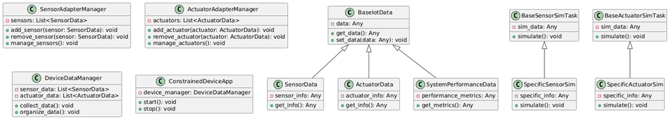

# Constrained Device Application (Connected Devices)

## Lab Module 03

Be sure to implement all the PIOT-CDA-* issues (requirements) listed at [PIOT-INF-03-001 - Lab Module 03](https://github.com/orgs/programming-the-iot/projects/1#column-10488379).

### Description

NOTE: Include two full paragraphs describing your implementation approach by answering the questions listed below.

What does your implementation do? 
This implementation is all about building a smart system that can manage data from sensors and actuators—think of it like the brain of an Internet of Things (IoT) device. Here’s a friendly rundown of what each part does:
1. Data Handling:
•	BaseIotData: Imagine this as the foundation of our data structure. It’s a general class that all our data types will build upon. From here, we have:
o	SensorData: This class deals with information from sensors—like temperature readings or motion detection.
o	ActuatorData: This one is about devices that take action, like turning on a light or adjusting a thermostat.
o	SystemPerformanceData: Here, we keep track of how well the system is running, like checking CPU usage or memory load.
2. Simulation Tasks:
•	BaseSensorSimTask: This acts like a template for simulating how sensors behave. You can create specific sensors from this base and define their unique actions.
•	BaseActuatorSimTask: Similar to the sensor task, this is a base class for simulating actuators, letting you define how different devices should operate.
3. Adapter Managers:
•	SensorAdapterManager: Think of this as a manager for your sensors. It takes care of setting them up, configuring them, and keeping everything running smoothly.
•	ActuatorAdapterManager: Just like the sensor manager, this one looks after the actuators, ensuring they’re ready to do their job whenever needed.
4. Data Management:
•	DeviceDataManager: This is like a librarian for all the data coming from sensors and actuators. It organizes and collects everything, making it easy to access and use.
•	ConstrainedDeviceApp Integration: In our main application (let's call it the “ConstrainedDeviceApp”), we create an instance of DeviceDataManager. When the app starts, it tells the manager to begin collecting data, and when it stops, it tells the manager to wrap things up. This keeps everything in sync

How does your implementation work?

The whole setup creates a structured way to handle data from sensors and actuators in an IoT system. It organizes everything neatly so that it’s easy to work with, making it simple to add new features or make changes later on.

1. Data Types:
•	BaseIotData: This is like a blueprint for all types of data we’ll use in our IoT system.
o	SensorData: This type stores information from sensors (like temperature or motion).
o	ActuatorData: This type holds information about devices that take actions (like turning on lights).
o	SystemPerformanceData: This keeps track of how well everything is running (like CPU usage).
2. Simulating Devices:
•	BaseSensorSimTask: This is a basic setup for simulating how sensors behave. You can create specific sensors from this and define their actions.
•	BaseActuatorSimTask: This works the same way for actuators, allowing you to simulate how they operate.
3. Managing Devices:
•	SensorAdapterManager: This class manages all the sensors—setting them up and keeping track of them.
•	ActuatorAdapterManager: This does the same for actuators, managing their setup and operation.
4. Collecting Data:
•	DeviceDataManager: This acts like a central hub that collects and organizes data from all sensors and actuators.
•	ConstrainedDeviceApp: In this main application, we create a DeviceDataManager. When the app starts, it tells the manager to start collecting data. When the app stops, it tells the manager to stop.

### Code Repository and Branch

NOTE: Be sure to include the branch (e.g. https://github.com/programming-the-iot/python-components/tree/alpha001).

URL: https://github.com/Francistapiwa/python-components/tree/lab03

### UML Design Diagram(s)

NOTE: Include one or more UML designs representing your solution. It's expected each
diagram you provide will look similar to, but not the same as, its counterpart in the
book [Programming the IoT](https://learning.oreilly.com/library/view/programming-the-internet/9781492081401/).

### Unit Tests Executed

NOTE: TA's will execute your unit tests. You only need to list each test case below
(e.g. ConfigUtilTest, DataUtilTest, etc). Be sure to include all previous tests, too,
since you need to ensure you haven't introduced regressions.
- DataUtilTest.py
- HvacActuatorSimTaskTest
- HumidifierActuatorSimTaskTest
-TemperatureSensorSimTaskTest
-PressureSensorSimTaskTest
-HumiditySensorSimTaskTest
-ActuatorDataTest
-SensorDataTest
-SystemPerformanceDataTest

- 
- 
- 

### Integration Tests Executed

NOTE: TA's will execute most of your integration tests using their own environment, with
some exceptions (such as your cloud connectivity tests). In such cases, they'll review
your code to ensure it's correct. As for the tests you execute, you only need to list each
test case below (e.g. SensorSimAdapterManagerTest, DeviceDataManagerTest, etc.)

- - ConstrainedDeviceAppTest
- DeviceDataManagerNoCommsTest
- ActuatorAdapterManagerTest
- SensorAdapterManagerTest

- 
- 

EOF.
