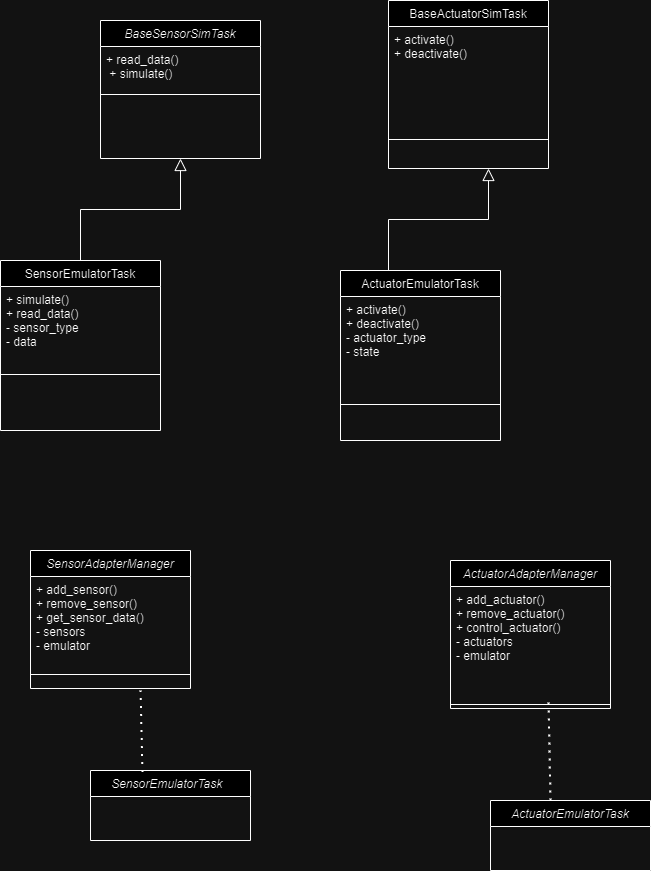

# Constrained Device Application (Connected Devices)

## Lab Module 04

Be sure to implement all the PIOT-CDA-* issues (requirements) listed at [PIOT-INF-04-001 - Lab Module 04](https://github.com/orgs/programming-the-iot/projects/1#column-10488386).

### Description

NOTE: Include two full paragraphs describing your implementation approach by answering the questions listed below.

What does your implementation do?
The main goal of the implementation is to create a flexible and extensible simulation framework for testing applications that rely on sensor and actuator interactions, especially for environments where real hardware may not be available or practical to use. This allows developers to simulate various scenarios and behaviors, helping with development, testing, and debugging processes. The implementation is designed to create a simulation environment for sensors and actuators, specifically tailored to emulate the functionalities of the Sense HAT and Pisense libraries.

How does your implementation work?
The implementation works through a structured approach that uses object-oriented principles to create a simulation environment for sensors and actuators. Here’s a step-by-step explanation of how the different components interact and function:
1. Class Structure
•	The implementation is built around abstract base classes (BaseSensorSimTask and BaseActuatorSimTask) that define common interfaces for sensor and actuator tasks.
•	Derived classes (SensorEmulatorTask and ActuatorEmulatorTask) provide concrete implementations of these interfaces, simulating the behavior of specific sensors and actuators.
2. Sensor Emulation
•	BaseSensorSimTask: This class outlines the essential methods (like read_data() and simulate()) that any sensor simulation class must implement.
•	SensorEmulatorTask: This class inherits from BaseSensorSimTask and implements the methods. It could generate random sensor data or mimic readings from actual sensors.
o	Example: If simulating a temperature sensor, it might generate a random temperature value within a realistic range.
3. Actuator Emulation
•	BaseActuatorSimTask: Similar to the sensor base class, this class defines methods like activate() and deactivate().
•	ActuatorEmulatorTask: Inherits from BaseActuatorSimTask and implements these methods. It can simulate turning an actuator on or off.
o	Example: If simulating a fan, the activate() method might change its state to "on," and deactivate() would change it to "off."
4. Adapter Managers
•	SensorAdapterManager: This class manages multiple sensor emulators. It has methods to:
o	Add or remove sensor instances.
o	Retrieve sensor data from the active sensors.
•	ActuatorAdapterManager: Similar to the sensor manager, but for actuators. It manages:
o	Adding/removing actuators.
o	Controlling their states.
5. Interaction Flow
•	Initialization: The user initializes instances of SensorAdapterManager and ActuatorAdapterManager.
•	Adding Sensors/Actuators: Users can add instances of SensorEmulatorTask and ActuatorEmulatorTask to their respective managers.
•	Simulating Data: When simulate() is called on a sensor emulator, it generates data that can be fetched through the manager.
•	Controlling Actuators: Users can call activate() or deactivate() methods on actuators through the actuator manager to simulate their behavior.
6. Extensibility
•	New sensor and actuator types can be easily added by creating new classes that inherit from the base classes, allowing for a flexible and extensible architecture.

### Code Repository and Branch

NOTE: Be sure to include the branch (e.g. https://github.com/programming-the-iot/python-components/tree/alpha001).

URL: 
https://github.com/Francistapiwa/python-components/tree/lab04
### UML Design Diagram(s)

NOTE: Include one or more UML designs representing your solution. It's expected each
diagram you provide will look similar to, but not the same as, its counterpart in the
book [Programming the IoT](https://learning.oreilly.com/library/view/programming-the-internet/9781492081401/).

### Unit Tests Executed

NOTE: TA's will execute your unit tests. You only need to list each test case below
(e.g. ConfigUtilTest, DataUtilTest, etc). Be sure to include all previous tests, too,
since you need to ensure you haven't introduced regressions.

- •	HumidityEmulatorTaskTest.py
•	PressureEmulatorTaskTest.py
•	TemperatureEmulatorTaskTest.py HvacEmulatorTaskTest.py
•	LedDisplayEmulatorTaskTest.py

- 
- 

### Integration Tests Executed

NOTE: TA's will execute most of your integration tests using their own environment, with
some exceptions (such as your cloud connectivity tests). In such cases, they'll review
your code to ensure it's correct. As for the tests you execute, you only need to list each
test case below (e.g. SensorSimAdapterManagerTest, DeviceDataManagerTest, etc.)

- 
- 
- 

EOF.
