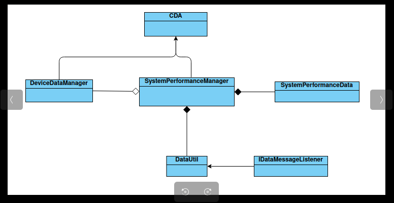

# Constrained Device Application (Connected Devices)

## Lab Module 05

Be sure to implement all the PIOT-CDA-* issues (requirements) listed at [PIOT-INF-05-001 - Lab Module 05](https://github.com/orgs/programming-the-iot/projects/1#column-10488421).

### Description

NOTE: Include two full paragraphs describing your implementation approach by answering the questions listed below.

What does your implementation do? 
Overall Implementation Goals
Ensure that performance data is consistently collected and available for further analysis or monitoring.
Provide an easy way to utilize this data through the DataUtil class, making it easier to manipulate or visualize the performance metrics.

1. SystemPerformanceManager Update
Purpose: The SystemPerformanceManager is responsible for collecting system performance data through the handleTelemetry() method.
Functionality:
Store the collected performance data in an instance of SystemPerformanceData.
If there is an IDataMessageListener reference available, it will call the appropriate method on this listener every time a new SystemPerformanceData instance is created. This allows for real-time notifications or handling of the newly available performance data.
2. DataUtil Class
Purpose: The DataUtil class is a utility class designed to facilitate operations related to data processing, manipulation, or management.
Implementation:
The specifics of what this class does would depend on the requirements and methods you implement within it.
Common functionalities might include data validation, formatting, transformation, or other utility functions that support the system performance data management.

How does your implementation work?
The implementation you described works through a combination of data collection, storage, and notification mechanisms. Here’s a breakdown of how it functions:

1. SystemPerformanceManager
Data Collection:

The handleTelemetry() method is invoked to gather system performance data, which might include metrics like CPU usage, memory consumption, disk I/O, etc.
Data Storage:

This data is then encapsulated in an instance of SystemPerformanceData. This class serves as a structured format to hold the performance metrics.
Notification Mechanism:

If the SystemPerformanceManager has a reference to an IDataMessageListener, it uses this to notify interested parties (like UI components or logging systems) whenever a new SystemPerformanceData instance is created.
This is likely done by invoking a specific callback method on the listener. This callback could handle the new data, such as logging it, updating a dashboard, or triggering alerts.
2. DataUtil Class
Utility Functions:
The DataUtil class, which you need to implement or edit, serves as a helper module. It can contain various methods that operate on the SystemPerformanceData objects.
Possible functionalities include:
Data Validation: Ensuring that the performance metrics meet certain criteria before they are processed.
Data Formatting: Converting the raw performance data into a more readable format for reports or logs.
Data Transformation: Performing calculations or aggregations on the data to extract meaningful insights (e.g., averages, trends).
Interaction Flow
Telemetry Handling:

When the system collects telemetry data, handleTelemetry() processes this information.
Data Creation:

A new SystemPerformanceData instance is created with the collected data.
Notification:

If a listener is registered, the manager invokes the corresponding callback to inform it of the new data. This might trigger actions such as updating visual components or storing the data for future use.
Utility Operations:

Whenever needed, the DataUtil class can be called upon to perform any utility functions on the SystemPerformanceData, making it easier to manage and analyze the performance metrics.

Overall, this design enables systematic collection and handling of system performance data while providing mechanisms for real-time notifications and utility functions to enhance data processing. Would you like further clarification on any specific aspect?

### Code Repository and Branch

NOTE: Be sure to include the branch (e.g. https://github.com/programming-the-iot/python-components/tree/alpha001).

URL: https://github.com/Francistapiwa/python-components/tree/lab05

### UML Design Diagram(s)

NOTE: Include one or more UML designs representing your solution. It's expected each
diagram you provide will look similar to, but not the same as, its counterpart in the
book [Programming the IoT](https://learning.oreilly.com/library/view/programming-the-internet/9781492081401/).

### Unit Tests Executed

NOTE: TA's will execute your unit tests. You only need to list each test case below
(e.g. ConfigUtilTest, DataUtilTest, etc). Be sure to include all previous tests, too,
since you need to ensure you haven't introduced regressions.

- DataUtilTest
- 
- 

### Integration Tests Executed

NOTE: TA's will execute most of your integration tests using their own environment, with
some exceptions (such as your cloud connectivity tests). In such cases, they'll review
your code to ensure it's correct. As for the tests you execute, you only need to list each
test case below (e.g. SensorSimAdapterManagerTest, DeviceDataManagerTest, etc.)

- SystemPerfomanceManager
- Data IntegrationTest
- 

EOF.
