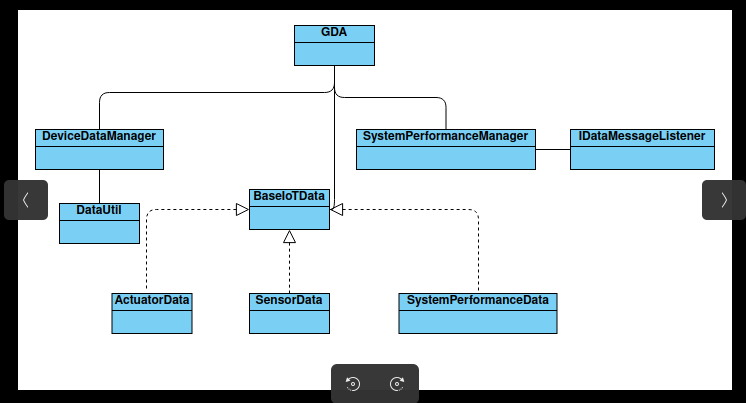

# Gateway Device Application (Connected Devices)

## Lab Module 05

Be sure to implement all the PIOT-GDA-* issues (requirements) listed at [PIOT-INF-05-001 - Lab Module 05](https://github.com/orgs/programming-the-iot/projects/1#column-10488421).

### Description

NOTE: Include two full paragraphs describing your implementation approach by answering the questions listed below.

What does your implementation do? 
Overall, the implementation creates a structured approach for managing sensor and actuator data, system performance metrics, and their integration into an IoT system. It emphasizes consistency, ease of data handling, and effective communication between components. This setup is crucial for building a robust IoT application that can efficiently interact with cloud services in the future.
How does your implementation work?

1. Data Classes
Classes:

SensorData, ActuatorData, SystemPerformanceData, and SystemStateData.
All these classes inherit from a common base class called BaseIotData.
Purpose:

Each class is designed to encapsulate specific types of data related to IoT devices.
They will include attributes for:
Name: A string representing the name of the sensor or actuator.
Type: An existing attribute that categorizes the type of data being handled.
Consistency:

Using a common structure helps in maintaining a consistent data format across the system, making it easier to map this data into cloud-based systems later.
Naming Conventions:

Predefined names and types will be stored in a configuration class (ConfigConst), ensuring uniformity across different components of the application.
2. SystemPerformanceManager Update
Functionality:
This manager will handle the collection of system performance data through a method called handleTelemetry().
When new performance data is collected, it creates an instance of SystemPerformanceData and stores this instance.
If an IDataMessageListener is set, it invokes a callback method on the listener to notify it of the new data.
3. DataUtil Class
Purpose:
The DataUtil class will contain utility methods to manipulate or process the data stored in the aforementioned data classes.
This might include methods for data validation, formatting, or transformation, allowing for easier management of the performance and sensor/actuator data.
4. DeviceDataManager Class
Functionality:
This new class, DeviceDataManager, will manage interactions and operations involving device data.
It may handle tasks like aggregating sensor readings, managing actuator commands, or coordinating with the SystemPerformanceManager.
5. Integration with GatewayDeviceApp
Usage:
An instance of DeviceDataManager will be created within the GatewayDeviceApp class.
The app will invoke the start and stop methods of DeviceDataManager in its own start and stop methods, establishing a lifecycle for managing device data alongside the main application.

### Code Repository and Branch

NOTE: Be sure to include the branch (e.g. https://github.com/programming-the-iot/python-components/tree/alpha001).

URL: https://github.com/Francistapiwa/Java-components/tree/lab05

### UML Design Diagram(s)

NOTE: Include one or more UML designs representing your solution. It's expected each
diagram you provide will look similar to, but not the same as, its counterpart in the
book [Programming the IoT](https://learning.oreilly.com/library/view/programming-the-internet/9781492081401/).

### Unit Tests Executed

NOTE: TA's will execute your unit tests. You only need to list each test case below
(e.g. ConfigUtilTest, DataUtilTest, etc). Be sure to include all previous tests, too,
since you need to ensure you haven't introduced regressions.

- DataUtilTest
- ActuatorDataTest
- SensorDataTest
- SystemPerfomanceDataTest
- SystemStateDataTest

### Integration Tests Executed

NOTE: TA's will execute most of your integration tests using their own environment, with
some exceptions (such as your cloud connectivity tests). In such cases, they'll review
your code to ensure it's correct. As for the tests you execute, you only need to list each
test case below (e.g. SensorSimAdapterManagerTest, DeviceDataManagerTest, etc.)

- GatewayDeviceAppTest
- DeviceDataManagerNoComms
- DataIntegrationTest
- SystemPerfomanceManagerTest

EOF.
